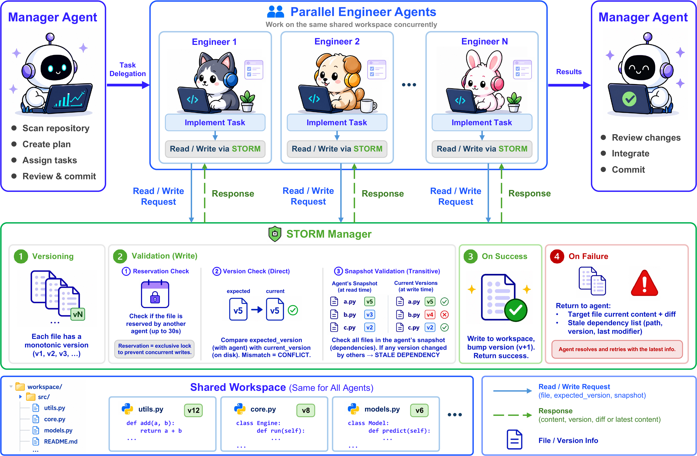

# STORM: Multi-agent Collaboration with State Management

Multi-agent orchestration framework for code implementation (Commit0) and paper reproduction (PaperBench) benchmarks. Built on OpenHands SDK.

<p align="center">
  
</p>

## Setup

### Prerequisites

- Python >= 3.12
- [uv](https://docs.astral.sh/uv/) (Python package manager)
- [Docker](https://docs.docker.com/get-docker/) (required by OpenHands)

### Installation

```bash
# Clone the repository
git clone https://github.com/dreamyang-liu/STORM.git
cd storm

# Install dependencies
uv sync

# (Optional) Install visualization dependencies
uv sync --extra viz

# (Optional) Install development dependencies
uv sync --extra dev

# (Optional) Install PaperBench judge dependencies (see PaperBench Judge section below)
```

### Environment Variables

```bash
export LLM_BASE_URL=<your-proxy-url>
export LLM_API_KEY=<your-api-key>
```

## Prepare Data

Each task requires its own dataset under the `data/` directory.

### Commit0

Download the [commit0_combined](https://huggingface.co/datasets/wentingzhao/commit0_combined) dataset and place it at:

```
data/commit0/commit0_combined/
```

### PaperBench

Place the PaperBench [data](https://github.com/openai/frontier-evals/tree/main/project/paperbench/data) at:

```
data/paperbench/
├── papers/
│   ├── rice/
│   │   ├── config.yaml
│   │   ├── paper.pdf
│   │   ├── paper.md
│   │   ├── rubric.json
│   │   ├── addendum.md
│   │   ├── blacklist.txt
│   │   └── assets/
│   └── ...
└── src/
    └── paperbench/
        └── instructions/
            └── instructions.txt
```

#### PaperBench Judge

PaperBench evaluation requires the `paperbench` and `preparedness-turn-completer` packages from OpenAI's [frontier-evals](https://github.com/openai/frontier-evals) repo. These packages are not on PyPI, so install them directly:

```bash
git clone https://github.com/openai/frontier-evals.git
cd frontier-evals
uv pip install -e "project/paperbench"
uv pip install -e "project/preparedness_turn_completer"
```

## Running Experiments

Two shell scripts are provided under `scripts/` for running experiments. Edit the parameters at the top of each script (model, task, paper_id/repo, iterations, etc.) before running.

### Single-Agent Mode

```bash
bash scripts/run_single.sh
```

Runs a single agent that performs the entire task (implement all functions for Commit0, or reproduce the paper for PaperBench). Key parameters:

| Parameter | Description |
|-----------|-------------|
| `task` | `"commit0"` or `"paperbench"` |
| `model` | LiteLLM model identifier |
| `max_iterations` | Maximum LLM iterations for the agent |
| `repo` | (Commit0) Repository name |
| `paper_id` | (PaperBench) Paper identifier |

### Multi-Agent Mode (STORM)

```bash
bash scripts/run_multi.sh
```

Runs the STORM multi-agent workflow: a manager agent delegates tasks to multiple engineer subagents working in parallel on a shared workspace with state management for conflict detection. Key parameters:

| Parameter | Description |
|-----------|-------------|
| `task` | `"commit0"` or `"paperbench"` |
| `model` | LiteLLM model identifier for the manager |
| `subagent_model` | Model for subagents (leave empty to use the same model) |
| `max_iterations` | Maximum LLM iterations for the manager |
| `max_subagents` | Number of parallel engineer subagents |
| `sub_iterations` | Maximum LLM iterations per subagent |
| `rounds_of_chat` | Maximum rounds of task assignment per engineer |

### Output

Results are saved to `outputs/<task>/<model>/<identifier>/<mode>/<params>/`, including:
- `cost.json` — token usage and cost breakdown
- `runtime.txt` — wall-clock runtime in seconds
- `outputs.jsonl` — structured event log
- `grade.json` — (PaperBench) judge evaluation results
- `report.json` — (Commit0) pytest results


## Adding a New Task

Each task is a self-contained file under `tasks/` that defines a config dataclass and a class that implements the `TaskModule` interface. See `tasks/commit0.py` or `tasks/paperbench.py` as examples.

### Steps

1. Create `tasks/my_task.py` with a `MyTaskConfig` dataclass for task-specific parameters (docker image, data paths, etc.) and a `MyTask` class that extends `TaskModule`.

2. Implement the six abstract methods defined in `tasks/base.py`:

   | Method | Purpose |
   |--------|---------|
   | `get_docker_image()` | Return the Docker image for the workspace container |
   | `get_work_dir()` | Return the working directory inside the container |
   | `get_workspace_config()` | Return a dict of parameters for workspace construction |
   | `load_task_data()` | Load task data from disk or dataset, store internally |
   | `setup_workspace(workspace)` | Prepare the container (clone repos, install deps, upload files) |
   | `evaluate(workspace)` | Run evaluation after the agent finishes, return a results dict |

3. Register in `tasks/__init__.py` by adding the import.

### Existing tasks

| Task | Description |
|------|-------------|
| `Commit0Task` | Implement functions in Python repos, evaluated via pytest |
| `PaperbenchTask` | Reproduce research papers, evaluated via reproduce.sh + LLM judge |


## Citation

```bibtex
@misc{liu2026multiagentcollaborationstatemanagement,
      title={Multi-agent Collaboration with State Management},
      author={Mengyang Liu and Taozhi Chen and Zhenhua Xu and Xue Jiang and Yihong Dong},
      year={2026},
      eprint={2605.20563},
      archivePrefix={arXiv},
      primaryClass={cs.MA},
      url={https://arxiv.org/abs/2605.20563},
}
```
